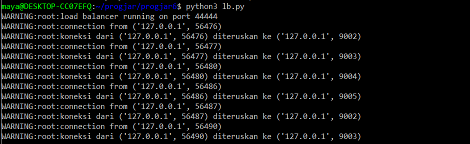
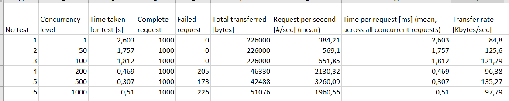
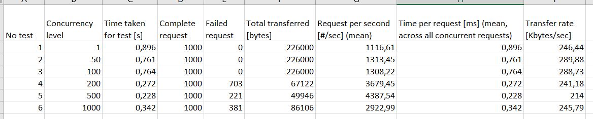
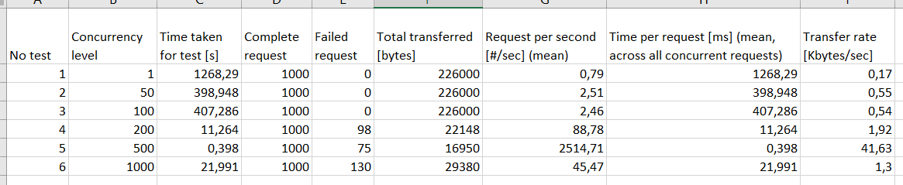

# Tugas 10 PROGJAR C Kholishotul Amaliah 05111740000030

### Log program dari lb.py
 

### Tabel hasil performance test dengan load balancing pada port 44444
 

### Tabel hasil performance test dengan asynchronous server pada port 45000
 

### Tabel hasil performance test dengan thread server pada port 46000
 
