# Tugas 5 PROGJAR C Kholishotul Amaliah 05111740000030

## Nama Services
Chatting protocol using multithread server

## Deskripsi program
Program ini merupakan protokol chatting dengan menggunakan multithread server. Program ini terdiri atas chat.py, chat-cli.py, server_thread_chat.py. Chat.py merupakan model dasar dari implementasi protokol chat. Berisikan fungsi-fungsi dasar yang dilakukan saat chatting. Chat-cli.py merupakan implementasi program client yang menggunakan model yang disediakan di file chat.py dan bertugas untuk menyediakan user interface kepada pengguna berbasis command line interface. Server_thread_chat.py merupakan multithreaded server yang menggunakan chat.py sebagai modelnya.<br>

## Format Data
Komunikasi dikirimkan ke socket dengan mengirimkan teks alfanumerik dengan format
<code>COMMAND spasi PARAMETER1 spasi PARAMETER2 dst...</code>

## Fitur-fitur program
1. Log in User
2. Mengirim Pesan
3. Melihat Inbox
4. Melihat Daftar User yang Aktif
5. Keluar dari Program

### Log in User
Pre-conditions : (tidak ada)

#### Deskripsi dan Tujuan
Sebelum melakukan percakapan dan dapat menggunakan fitur-fitur lainnya, user diminta login sehingga server dapat mengautentikasi user. Mulanya pada database terdapat 3 user, yaitu izza, maya, dan nania.

#### Parameter Input
Untuk log in user, gunakan command <code>auth</code> dan masukkan username serta password user. Sebagai contoh adalah sebagai berikut :<br>
```
auth {username} {password}
```
Command : auth<br>
Parameter : username (spasi) password<br>
Command tersebut kemudian dikirim ke server untuk diproses.<br><br>

#### Hasil Keluaran, Penjelasan, Status Keluaran
Jika autentikasi berhasil, maka akan muncul pesan bahwa user sudah logged in dan token id-nya. Sebagai contoh adalah sebagai berikut :<br>
```
status : OK, tokenid : {tokenID}
username {username} logged in, token {tokenid}
```
Jika autentikasi gagal, maka akan muncul pesan error dan alasan error-nya. Sebagai contoh adalah sebagai berikut :<br>
```
status : ERROR, message : User is not found
Error, User is not found
```
```
status : ERROR, message : Wrong password<br>
Error, Wrong password
```

#### Contoh Message Input dan Keluaran
Jika berhasil<br>
client side<br>
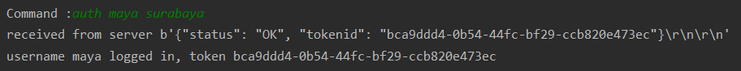<br>
server side<br>
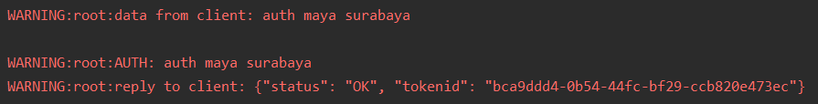<br><br>
Jika gagal karena user tidak ditemukan<br>
client side<br>
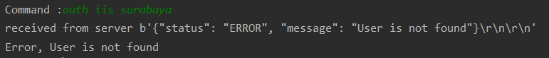<br>
server side<br>
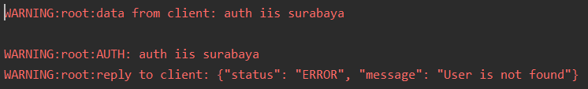<br><br>
Jika gagal karena salah menginputkan password
client side<br>
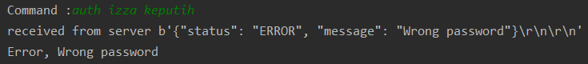<br>
server side<br>
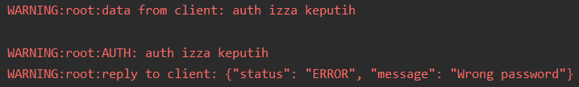<br>


### Mengirim Pesan
Pre-conditions :
-	Sudah log in
-	Mengetahui user lain yang aktif

#### Deskripsi dan Tujuan
User dapat mengirim pesan ke user lain berupa teks.

#### Parameter Input
Untuk mengirim pesan, gunakan command <code>send</code> dan masukkan username tujuan serta pesannya. Sebagai contoh adalah sebagai berikut :<br>
```
send {username} {message}
```
Command : send<br>
Parameter : username_tujuan (spasi) pesan<br>
Command tersebut kemudian diproses dan dikirim ke server dengan parameter token ID, username pengirim, username tujuan, dan pesan.<br><br>

#### Hasil Keluaran, Penjelasan, Status Keluaran
Jika pesan berhasil terkirim, maka akan muncul pesan bahwa pesan terkirim. Sebagai contoh adalah sebagai berikut :<br>
```
status : OK, message : Message sent<br>
message sent to {username}
```
Jika pesan gagal terkirim, maka akan muncul pesan error dan alasan error-nya. Sebagai contoh adalah sebagai berikut :<br>
```
status : ERROR, message : User is not found<br>
Error, User is not found
```

#### Contoh Message Input dan Keluaran
Jika berhasil<br>
client side<br>
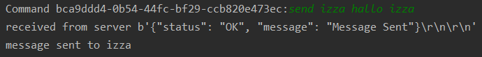<br>
server side<br>
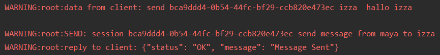<br><br>
Jika gagal karena username tujuan tidak ditemukan<br>
client side<br>
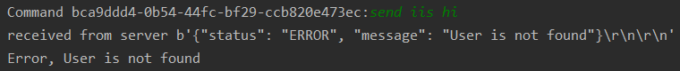<br>
server side<br>
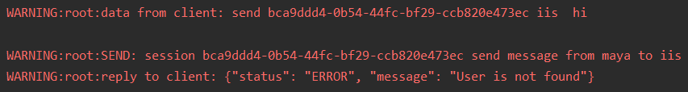<br>


### Melihat Inbox
Pre-conditions :
-	Sudah log in

#### Deskripsi dan Tujuan
User dapat melihat kotak masuk dari pesan-pesan yang dikirimkan user lain kepadanya.

#### Parameter Input
Untuk melihat inbox, gunakan command <code>inbox</code>. Sebagai contoh adalah sebagai berikut :<br>
```
inbox
```
Command : inbox
Parameter : (tidak ada)
Command tersebut kemudian diproses dan dikirim ke server dengan parameter tokenID.<br><br>

#### Hasil Keluaran, Penjelasan, Status Keluaran
Jika terdapat pesan yang diterima dari orang lain, maka akan muncul pesan-pesannya. Sebagai contoh adalah sebagai berikut :<br>
```
status : OK, message : {"{username_sender}": [{"msg_from": {name_sender}, "msg_to": {name_receiver}, "msg": {message}}]}
{"{username_sender}": [{"msg_from": {name_sender}, "msg_to": {name_receiver}, "msg": {message}}]}
```
Jika gagal mendapatkan inbox, maka akan muncul pesan error.<br>

#### Contoh Message Input dan Keluaran
client side<br>
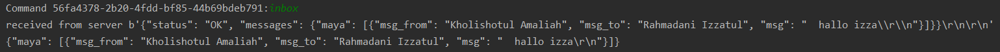<br>
server side<br>
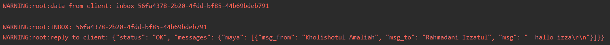<br>


### Melihat Daftar User yang Aktif
Pre-conditions :
-	Sudah log in

#### Deskripsi dan Tujuan
User dapat melihat user yang sedang aktif pada server yang sama. User aktif adalah user yang sudah log in.

#### Parameter Input
Untuk melihat daftar user yang aktif, gunakan command <code>list</code>. Sebagai contoh adalah sebagai berikut :<br>
```
list
```
Command : list<br>
Parameter : (tidak ada)<br>
Command tersebut kemudian dikirim ke server untuk diproses.<br><br>

#### Hasil Keluaran, Penjelasan, Status Keluaran
Jika berhasil, server kemudian membalas dengan daftar username yang sedang aktif berupa data json.
```
status : OK, messages : {json username data}
{json data username}
```
Jika gagal mendapatkan daftar username, maka akan muncul pesan error.<br>

#### Contoh Message Input dan Keluaran
client side<br>
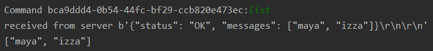<br>
server side<br>
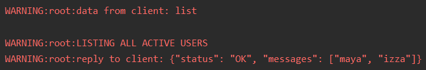<br>


### Log out User
Pre-conditions :
-	Sudah log in

#### Deskripsi dan Tujuan
User dapat keluar dari ruang percakapan dengan menghapus session.

#### Parameter Input
Untuk keluar dari percakapan, gunakan command <code>logout</code>. Sebagai contoh adalah sebagai berikut :<br>
```
logout
```
Command : logout<br>
Parameter : (tidak ada)
Command tersebut kemudian diproses dan dikirim ke server dengan parameter session ID. Session ID tersebut kemudian dihapus dari server maupun client, sehingga user telah keluar dari percakapan.<br><br>

#### Hasil Keluaran, Penjelasan, Status Keluaran
Jika berhasil, server kemudian membalas dengan pesan bahwa user telah ter-log out.
```
status : OK, messages : Logged out
“Logged out”
```
Jika gagal log out, maka akan muncul pesan error.<br>

#### Contoh Message Input dan Keluaran
sebelumnya, list user adalah sebagai berikut :<br>
<br>
kemudian, menjalankan fungsi logout<br>
client side<br>
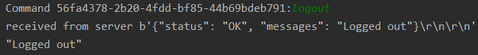<br>
server side<br>
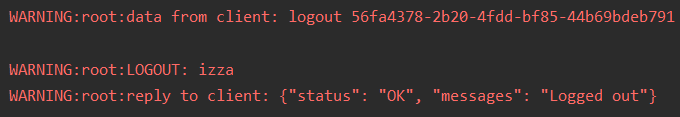<br>
sehingga list user menjadi<br>
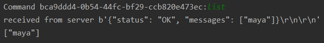<br>


### Keluar dari Program
Pre-conditions : sudah log in<br><br>

#### Deskripsi dan Tujuan
User dapat log out dari percakapan sekaligus keluar dari program secara langsung. Selain itu, user juga dapat memutuskan hubungan socket dengan server.

#### Parameter Input
Untuk keluar dari program, gunakan command <code>exit</code>. Sebagai contoh adalah sebagai berikut :<br>
```
exit
```
Command : exit<br>
Parameter : (tidak ada)
Command tersebut menjalankan fungsi logout, kemudian memutuskan hubungan socket dengan server. Kemudian user telah keluar dari program.<br>

#### Hasil Keluaran, Penjelasan, Status Keluaran
Jika berhasil maka muncul pesan<br>
```
status : OK, messages : Logged out
Exit from program
```

#### Contoh Message Input dan Keluaran
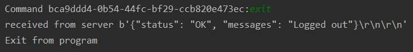<br>
