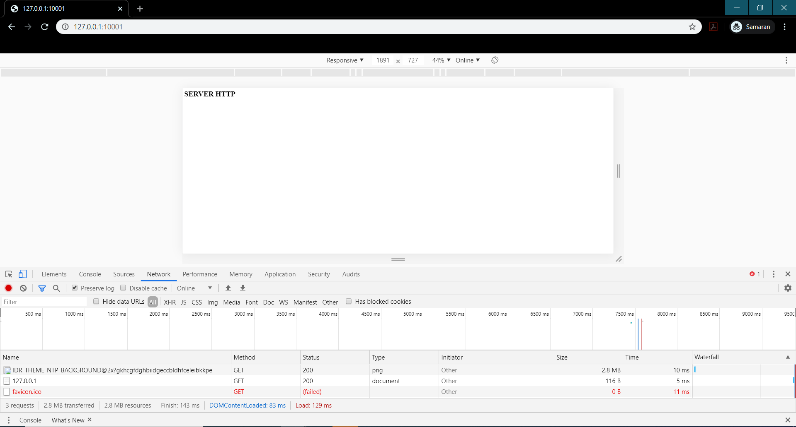
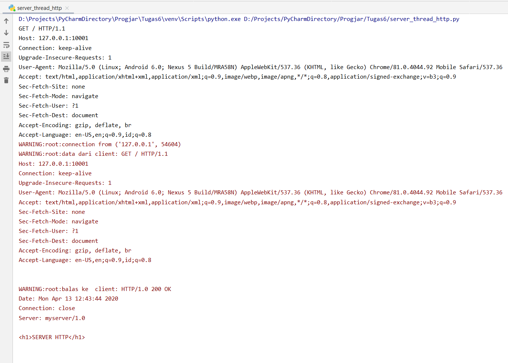

# Tugas 6 PROGJAR C Kholishotul Amaliah 05111740000030

## Nama Services
Simple Web Server

## Deskripsi program
Program ini merupakan protokol web server dengan menggunakan multithread server yang dapat melayani string tertentu. Program ini terdiri atas http.py dan server_thread_http.py. http.py merupakan model dasar dari implementasi protokol http. Berisikan fungsi-fungsi dasar yang dilakukan saat mereply sebuah request. server_thread_http.py merupakan multithreaded server yang menggunakan http.py sebagai modelnya.<br>

## Testing
* Sebuah multithreaded server, dibuka pada port 10001 di ip address 127.0.0.1
* Program ini dapat melayani string berupa
```
GET spasi / spasi HTTP/1.0
```
dengan tanda akhir request adalah "\r\n\r\n"
* Jika tanda akhir request diterima, maka balaslah dengan string 
```
<h1>SERVER HTTP</h1>
```

## Hasil
Ketika dijalankan pada Chrome browser, dengan mengakses "127.0.0.1:10001", maka muncul tampilan<br>
<br><br>
Sedangkan berikut adalah tampilan pada server<br>
<br>
